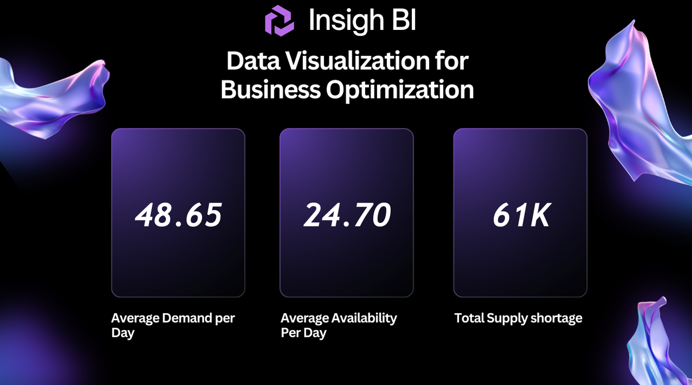
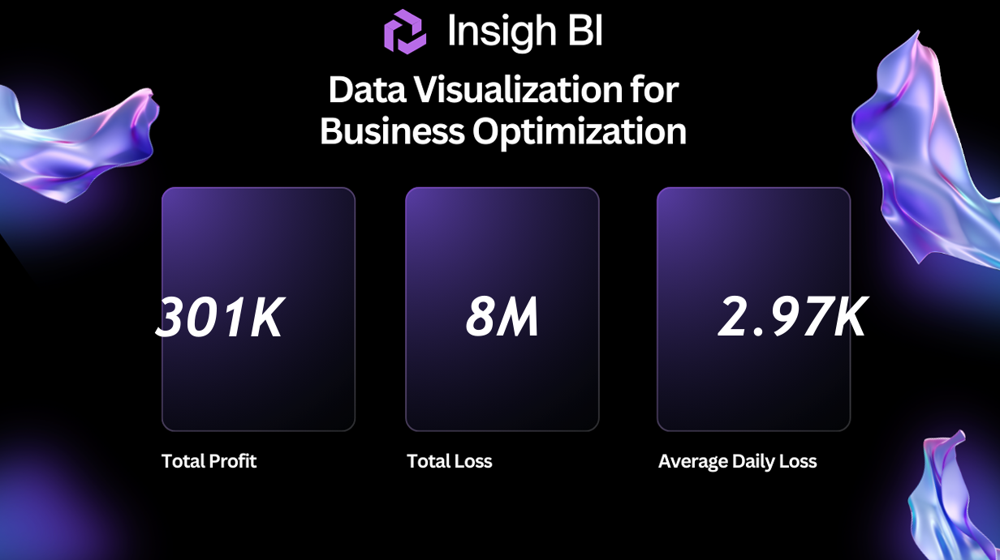

# End-to-End Inventory Analysis Power BI Project

This repository contains an end-to-end Power BI project designed for analyzing and visualizing product inventory data. The primary objective is to build a comprehensive dashboard that compares key inventory metrics—such as product availability and demand—between the **Production (Prod)** and **Test** environments.

## 📊 Report Dashboard Screenshots

Below are screenshots from the final Power BI report.

### Page 1

### Page 2

## Project Objective

The main goal of this dashboard is to provide stakeholders with a clear, at-a-glance view of the inventory status. By comparing production data against test data, the business can:
* Identify discrepancies between the two environments.
* Analyze demand trends for specific products.
* Monitor stock availability to prevent stockouts.
* Calculate the total value of demanded inventory.

## Data Sources

This report connects to live data from two different database environments:
* **MySQL Database**
* **SQL Server**

For demonstration purposes, this repository includes three sample CSV datasets that reflect the data structure:
1.  **`Products.csv`**: A dimension table containing product details (`Product ID`, `Product Name`, `Unit Price ($)`).
2.  **`Prod+Env+Inventory+Dataset.csv`**: A fact table with transactional data from the Production environment (`Order Date`, `Product ID`, `Availability`, `Demand`).
3.  **`Test+Environment+Inventory+Dataset.csv`**: A fact table with corresponding data from the Test environment.

## Tools Used

* **Power BI Desktop**: For data modeling, analysis, and visualization.
* **Power Query**: For data extraction, transformation, and loading (ETL).
* **DAX (Data Analysis Expressions)**: For creating custom measures and KPIs.
* **MySQL**: Source database.
* **SQL Server**: Source database.

## Data Model

The project uses a simple **Star Schema** with one central dimension table (`Products`) connected to the two fact tables (`Prod_Inventory` and `Test_Inventory`).

* **Dimension Table**: `Products`
* **Fact Tables**: `Prod_Inventory`, `Test_Inventory`
* **Relationship**: A one-to-many (`1:*`) relationship is established between `Products[Product ID]` and the `Product ID` columns in both fact tables.

## Key Performance Indicators (KPIs) & Analysis

The following key metrics were calculated using DAX to drive the insights in the report:

1.  **Total Availability (Prod vs. Test)**:
     To measure the total quantity of products available in stock for each environment.
    

2.  **Total Demand (Prod vs. Test)**:
     To measure the total quantity of products ordered or demanded by customers.
    
3.  **Total Demand Value (Prod vs. Test)**:
    To calculate the total monetary value of the demanded products.
    

